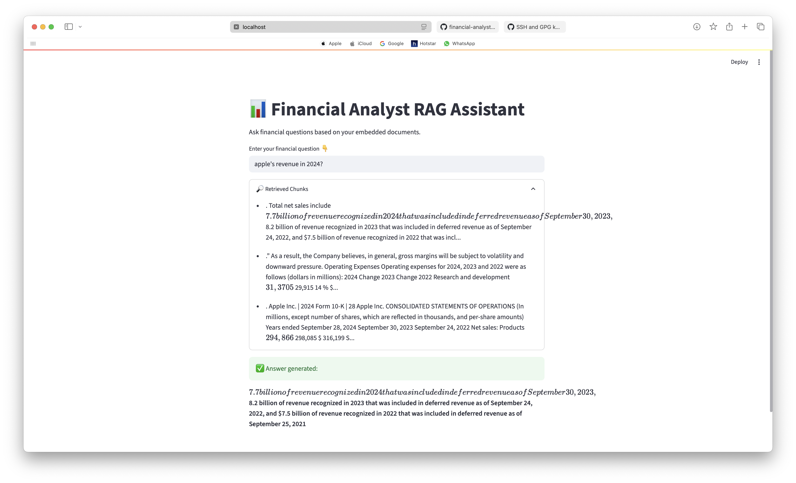

# Financial Analyst RAG Assistant

A Retrieval-Augmented Generation (RAG) application for answering financial questions directly from corporate filings and reports using LangChain, FAISS, and HuggingFace Sentence Transformers.

## Overview

This project enables analysts and users to query financial data from embedded company documents such as 10-Ks, earnings reports, and press releases. It utilizes state-of-the-art semantic search and a question-answering pipeline to extract relevant insights with high accuracy.

<p align="center">
  
</p>

---

## Features

- **PDF ingestion**: Supports uploading and embedding financial documents in PDF format
- **Semantic retrieval**: Chunks and embeds documents using `all-MiniLM-L6-v2`
- **Retrieval-Augmented Generation (RAG)**: Combines FAISS retrieval with local or OpenAI-powered QA
- **Streamlit Interface**: Simple, user-friendly frontend
- **Fast indexing**: Local FAISS vector store for efficient semantic search
- **Optional OpenAI Integration**: Enhances responses with GPT-backed reasoning

---

## Setup Instructions

### 1. Clone the Repository

```bash
git clone https://github.com/anshi312/financial-analyst-rag.git
cd financial-analyst-rag
```

### 2. Create and Activate a Virtual Environment

```bash
python3 -m venv .venv
source .venv/bin/activate
pip install -r requirements.txt
```

### 3. Add Your Financial Documents

Place all relevant PDF files inside the `data/` directory.

### 4. Generate Embeddings and Build FAISS Index

```bash
python embeddings/embed_store_faiss.py
```

### 5. Launch the Application

```bash
python app.py
```

---

## Technologies Used

- Python 3.10+
- LangChain
- FAISS
- HuggingFace Sentence Transformers
- PyMuPDF
- Streamlit
- OpenAI API (optional)

---

## Project Structure

```
financial-analyst-rag/
├── app.py                    # Main application
├── data/                     # Financial reports in PDF
├── embeddings/               # Embedding logic and indexing
│   ├── embed_store_faiss.py
│   ├── text_processor.py
│   ├── test_faiss_query.py
│   └── test_text_processor.py
├── rag/                      # RAG pipeline modules
│   ├── rag_pipeline.py
│   └── setup_rag.py
├── scraping/                 # (Optional) Financial web scrapers
│   ├── earnings_scraper.py
│   ├── news_scraper.py
│   ├── sec_scraper.py
│   └── utils.py
├── test_env.py               # Environment variable test
├── test_hf_pipeline.py       # QA pipeline test
├── requirements.txt          # Python dependencies
├── instruct.txt              # Prompt/instruction templates
├── .gitignore
└── README.md
```

---

## Example Queries

- “What was Netflix’s total revenue in 2024?”
- “Provide a breakdown of Apple’s net income by product line.”
- “Compare Microsoft and Apple’s R&D expenditure for the last fiscal year.”

---

## Security Notes

- API keys are excluded via `.gitignore`.
- Store API credentials securely in `config/.env`.

**Example**:

```
OPENAI_API_KEY=your-key-here
```

**Do not** hardcode secrets directly into the source files.

---

## License

This project is licensed under the [MIT License](https://opensource.org/licenses/MIT).

---

## Author

**Anshi Shah**  
MS in Computer Engineering, NYU Tandon School of Engineering  
📧 ans10020@nyu.edu  
🔗 [LinkedIn](https://linkedin.com/in/shah-anshi)

---
